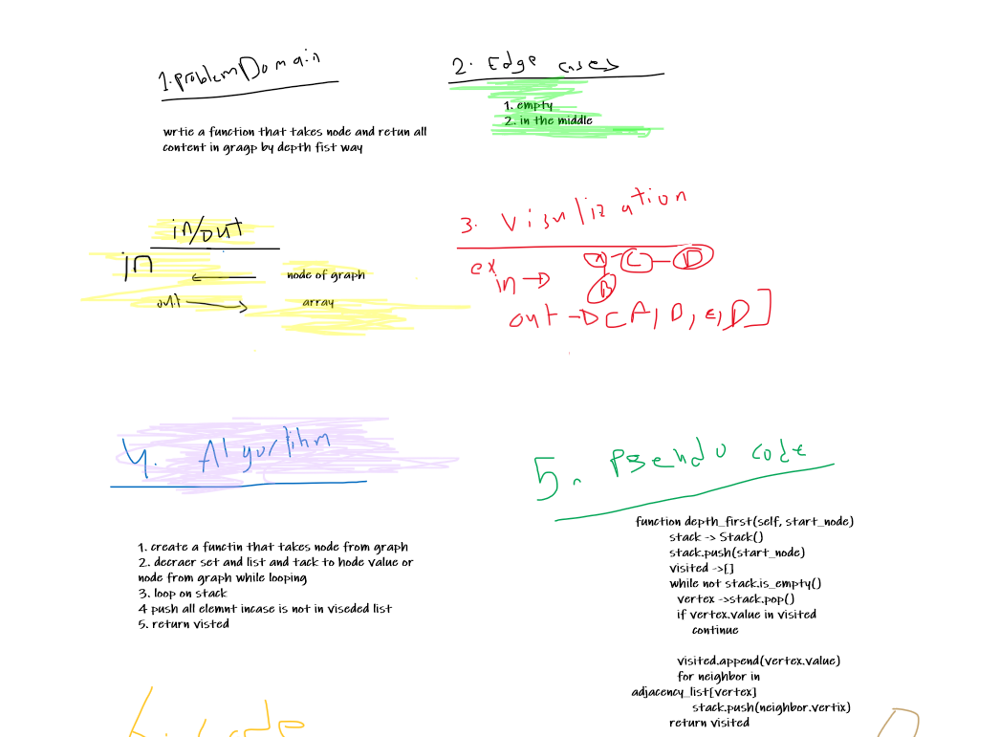
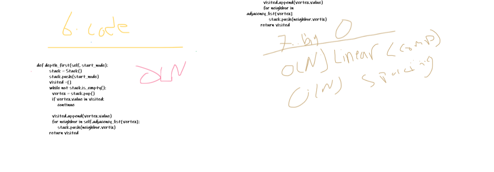
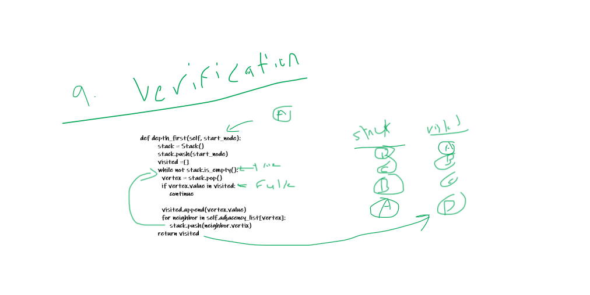

# Challenge

- Implement a Graph. with Hash Map
# WhiteBoard

** Code Challane Class 38**

# Approach & Efficiency

Big O
o(n)

# API

**AddNode():**

    - Adds a new node to the graph

**AddEdge():**

    - Adds a new edge between two nodes in the graph

**GetNodes():**

- Returns all of the nodes in the graph as a collection (set, list, or similar)

**GetNeighbors():**

    - Returns a collection of edges connected to the given node  

**Size():**

- Returns the total number of nodes in the graph$