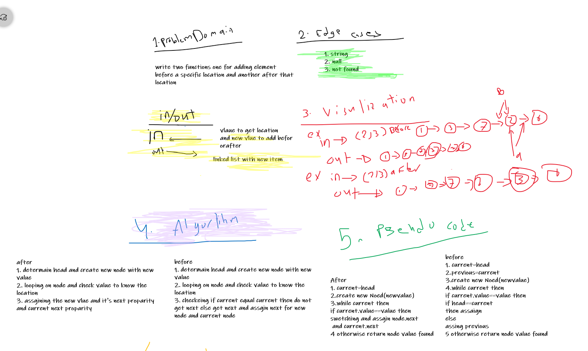
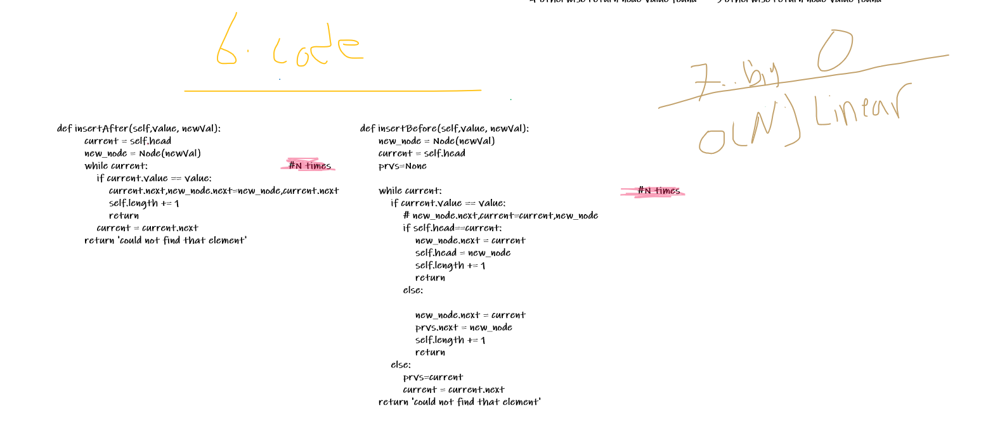
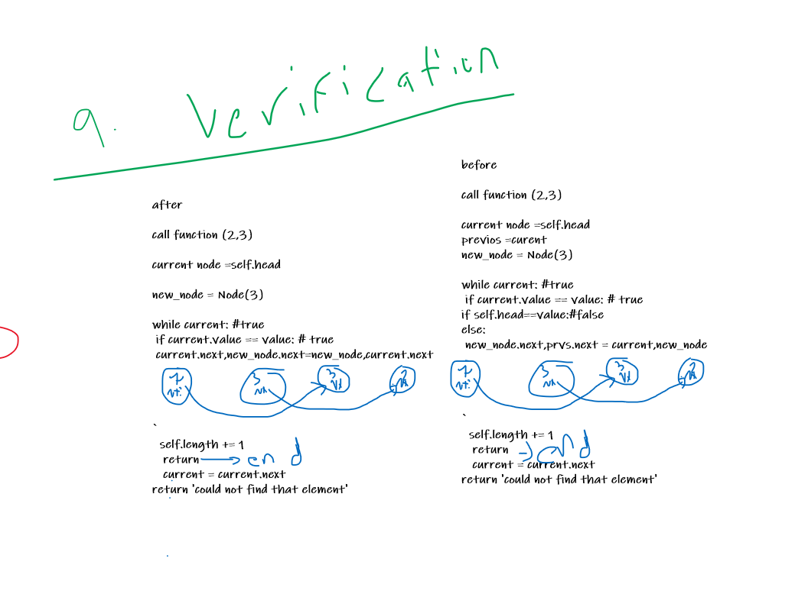

# Singly Linked List


## Challenge Summary
Create a Node class that has properties for the value stored in the Node, and a pointer to the next Node with inserting methods.
## Whiteboard Process





## Solution

```
after 

call function (2,3)

current node =self.head

new_node = Node(3)  

while current: #true
 if current.value == value: # true                                     
 current.next,new_node.next=new_node,current.next
`
  self.length += 1
   return
   current = current.next
return 'could not find that element'
 
```

```
before

call function (2,3)

current node =self.head
previos =curent
new_node = Node(3)  

while current: #true
 if current.value == value: # true 
if self.head==value:#false
else: 
 new_node.next,prvs.next = current,new_node 

  self.length += 1
   return
   current = current.next
return 'could not find that element'
  
```


## Approach & Efficiency
I used two classes and used one class for Node and other to create Object form Node class also i create append,insert,isertbefore,insertafter methodes.

## API

`--init--` : it will initialize a linked list.
`insert` : it will insert a node into the list.
`includes` : it takes a value then checks if it's in the array.
`__str__`: it will print the array in a specific way.
`__append__`: it adds a value to the end.
`__insertBefore__`: it add a new value before a certain value.
`__insertAfter__`: it add a new value after a certain value.

