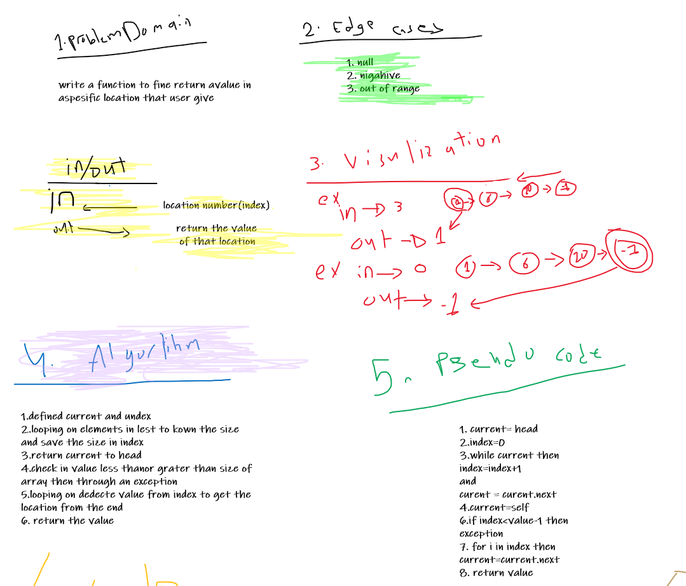
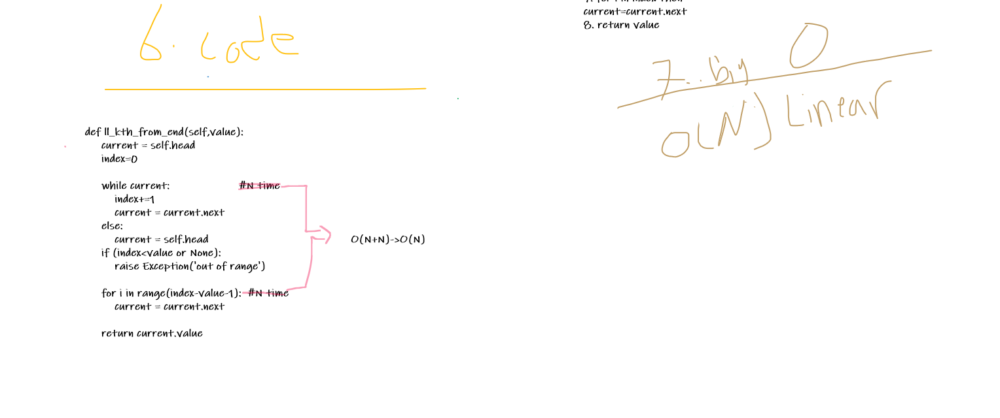
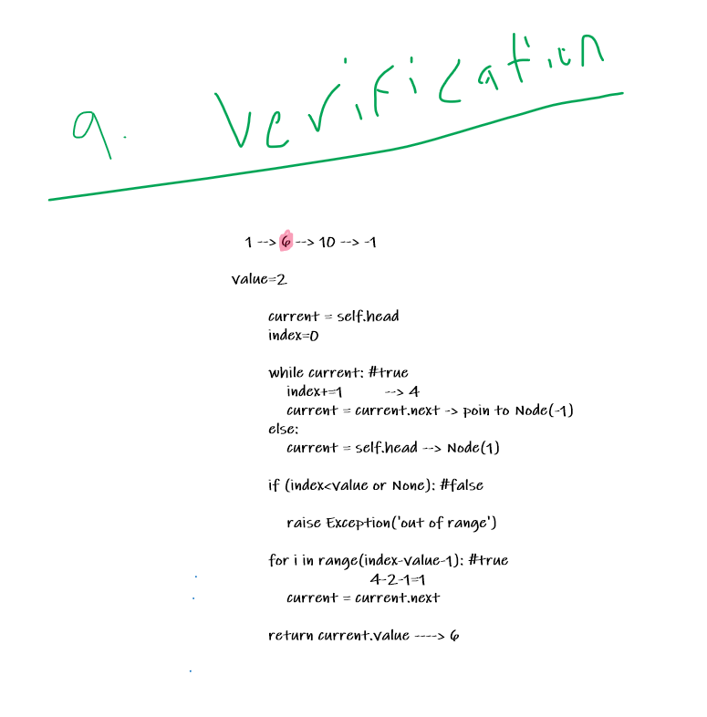

# Singly Linked List


## Challenge Summary
Create a Node class that has properties for the value stored in the Node, and a pointer to the next Node with inserting an include with ll_kth_from_end methods.


## Whiteboard Process









## Solution

```
   1 --> 6 --> 10 --> -1

value=2

        current = self.head 
        index=0

        while current: #true                     
            index+=1         --> 4
            current = current.next -> poin to Node(-1)
        else:
            current = self.head --> Node(1)                                           

        if (index<value or None): #false

            raise Exception('out of range')

        for i in range(index-value-1): #true
                              4-2-1=1
            current = current.next

        return current.value ----> 6
 
```


## Approach & Efficiency
I used two classes and used one class for Node and other to create Object form Node class also i create append,insert,isertbefore,insertafter and ll_kth_from_end methodes.

## API

`--init--` : it will initialize a linked list.
`insert` : it will insert a node into the list.
`includes` : it takes a value then checks if it's in the array.
`__str__`: it will print the array in a specific way.
`__append__`: it adds a value to the end.
`__insertBefore__`: it add a new value before a certain value.
`__insertAfter__`: it add a new value after a certain value.
`__ll_kth_from_end__`: it add a new value after a certain value.


