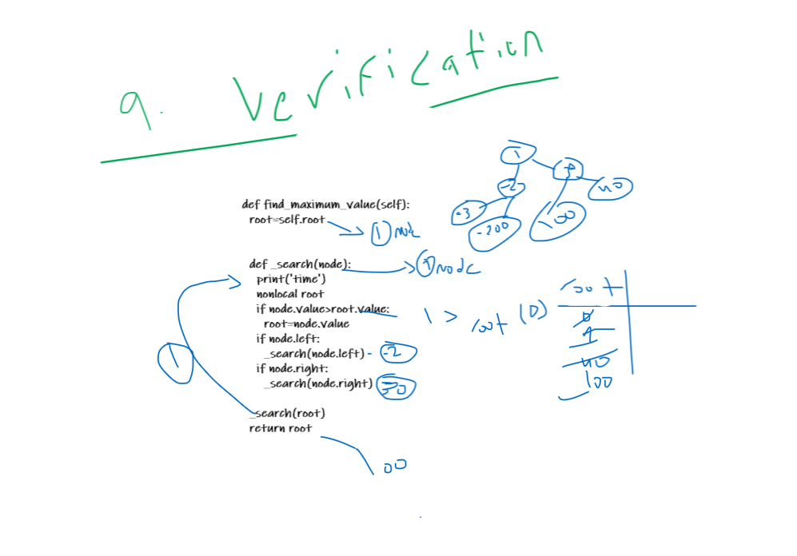

# Trees

- Make atree node with it's methods

## Challenge

- Creating a tree that can be traversed with 3 different methods and adding nodes using binary search .

## Whiteboard Process

## Approach & Efficiency

BinaryTree: they will return the tree in this order:

- pre_order==> root-->left-->right
- in_order==> left-->root-->right
- post_order==> left-->right-->root 
BinarySearchTree:
- add--> accepts a value, and adds a new node with that value in the correct location in the binary search tree.
- contains--> accepts a value, and returns a boolean indicating whether or not the value is in the tree at least once. 
- find_max_value --> a function loop on all tree node and retun the max number

## API

- my approach was a recursion function.