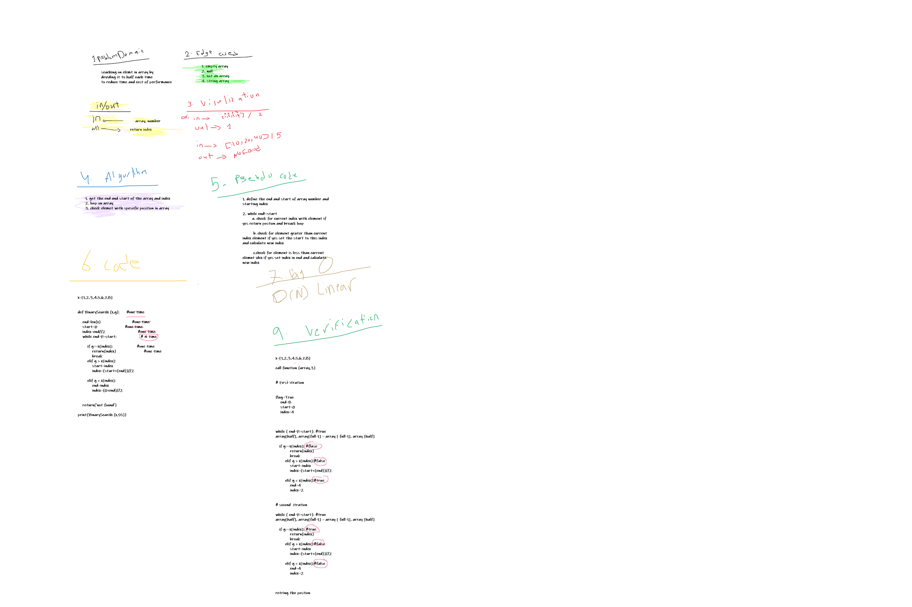

# BinarySearch

#### Build a function to take sort array and number to search 

## Whiteboard Process

## Approach & Efficiency

#### I have used simple way to get element from sort array is by divide the array each time depending on if current element in sepesific location in array less or grater than elemt we provided to search.