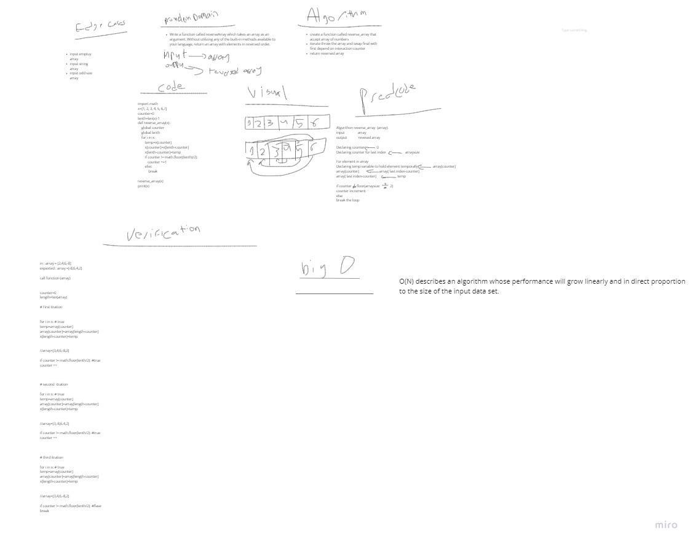

# Reverse an Array

#### Build a function to take any kind of array and revers it

## Whiteboard Process

**To see picture in big size  [Zoom](https://miro.com/app/board/o9J_lA5v1eA=/)**

## Approach & Efficiency

#### I have used simple way in reversing array is switching and avoid using nested for loop because this will cost time and memory ... therefore my code represent  O(N) not O(N^2)... also I used pseudocode and algorithm to apply my idea before writing code .. then i verified my code with simple table to test me code .. and of course i put my code under edgecase.