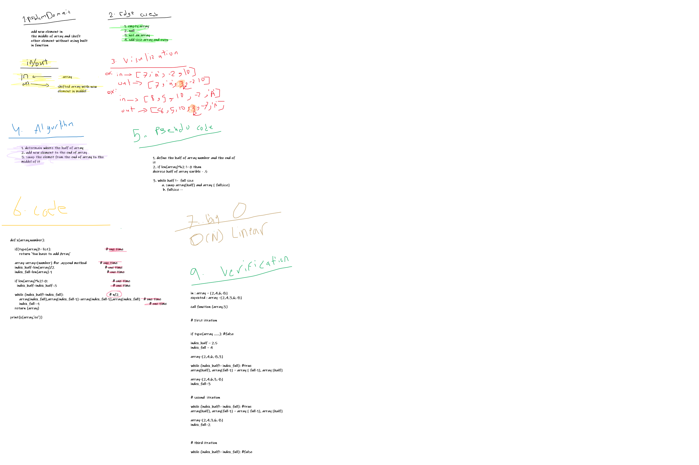

# Shifting an Array

#### Build a function to take any kind of array and shifting in the meddile to add number it

## Whiteboard Process

## Approach & Efficiency

#### I have used simple way in shifting array first add the elemet to the end of aray then get the middle of array and start looping from the end to the meddil to swap them, also avoid using nested for loop because this will cost time and memory ... therefore my code represent  O(N) not O(N^2)... also I used pseudocode and algorithm to apply my idea before writing code .. then i verified my code with tracing code shows value passing during function .. and of course i put my code under edgecase.