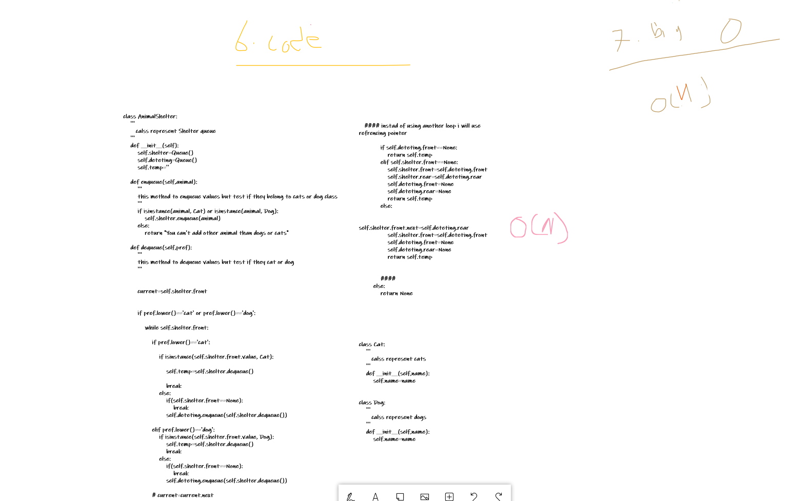

# Challenge Summary
Create a class called AnimalShelter which holds only dogs and cats. The shelter operates using a first-in, first-out approach.

## Whiteboard Process





## Approach & Efficiency
defining a new class that we will instantiate with two queues one for cats and the other for dogs.

## Solution

```

class AnimalShelter:
    '''
       calss represent Shelter queue
    '''
    def __init__(self):
        self.shelter=Queue()
    
    def enqueue(self,animal):
        '''
        this method to enqueue values but test if they belong to cats or dog class
        '''
        if isinstance(animal, Cat) or isinstance(animal, Dog):
            self.shelter.enqueue(animal)
        else:
            return "You can't add other animal than dogs or cats"

    def dequeue(self,pref):
        '''
        this method to dequeue values but test if they cat or dog 
        '''
        if pref.lower()=='cat' or pref.lower()=='dog':
            return self.shelter.dequeue()
        else:
            return None

class Cat:
    '''
       calss represent cats
    '''
    def __init__(self,name):
        self.name=name


class Dog:
    '''
       calss represent dogs
    '''
    def __init__(self,name):
        self.name=name
```
