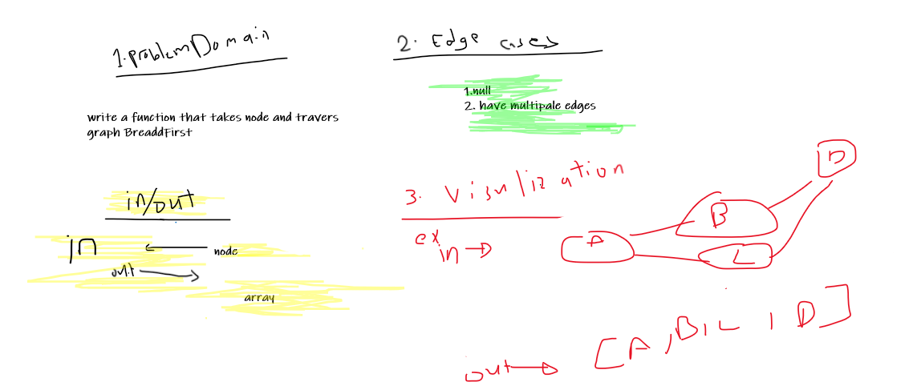
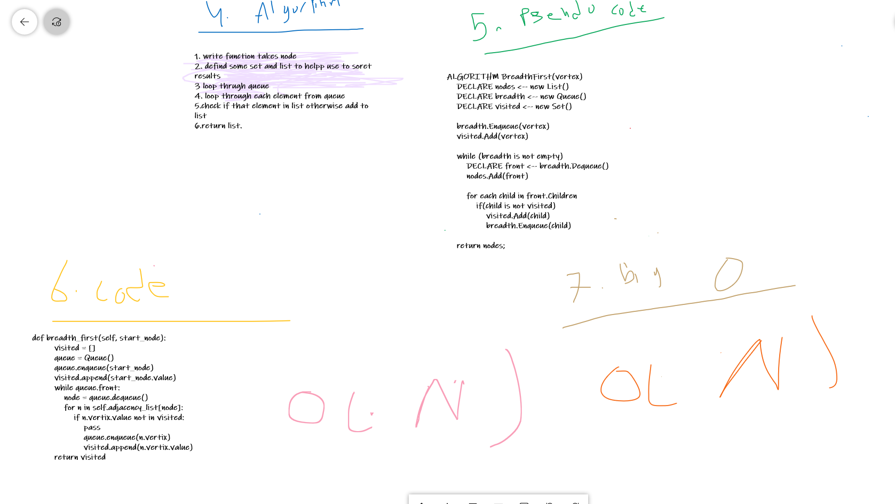
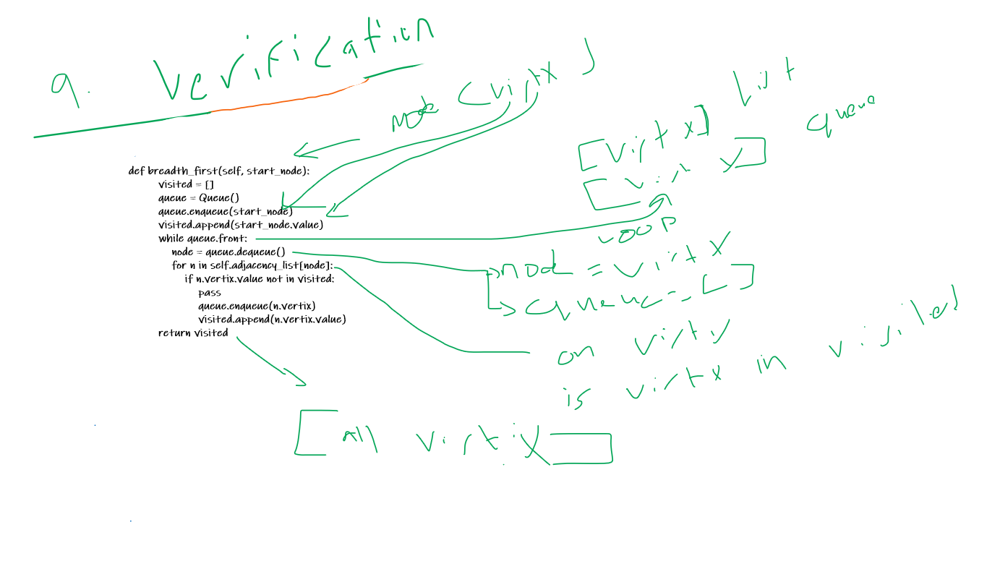

# Challenge Summary
- Write a function that travers graph BreadthFirst.

## Whiteboard Process




## Approach & Efficiency
Big O
O(N) complixtiy
O(N) space

## Solution
```
    def breadth_first(self, start_node):
            visited = [] 
            queue = Queue() 
            queue.enqueue(start_node) 
            visited.append(start_node.value)
            while queue.front: 
                node = queue.dequeue() 
                for n in self.adjacency_list[node]: 
                    if n.vertix.value not in visited: 
                        
                        queue.enqueue(n.vertix)                        
                        visited.append(n.vertix.value)
            return visited

```