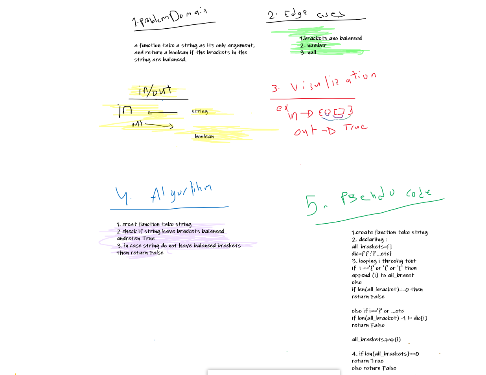
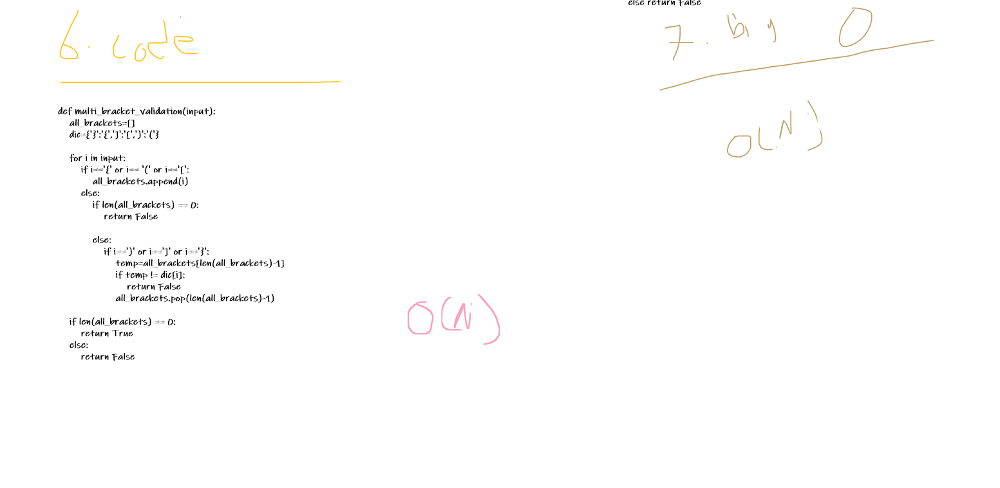
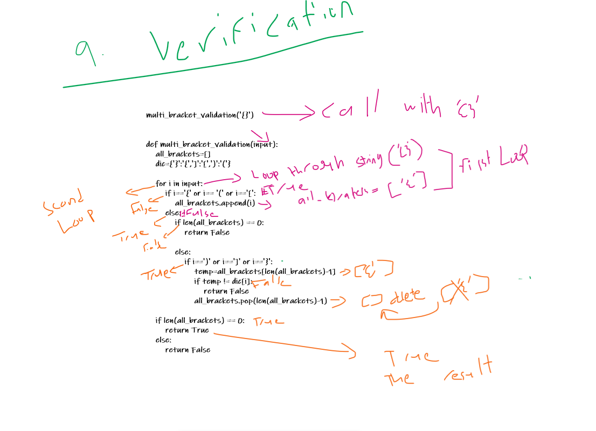

# Challenge Summary
A function take a string as its only argument, and return a boolean if the brackets in the string are balanced.

## Whiteboard Process





## Approach & Efficiency
Making a stack and push the openings of the brackets and poping the openings when the closings are found.

## Solution

```
def multi_bracket_validation(input):    
    all_brackets=[]
    dic={'}':'{',']':'[',')':'('}
    
    for i in input:
        if i=='{' or i== '(' or i=='[':
            all_brackets.append(i)            
        else:
            if len(all_brackets) == 0:               
                return False
                
            else:
                if i==')' or i==']' or i=='}':
                    temp=all_brackets[len(all_brackets)-1]
                    if temp != dic[i]:                        
                        return False
                    all_brackets.pop(len(all_brackets)-1)

    if len(all_brackets) == 0: 
        return True
    else:
        return False
```